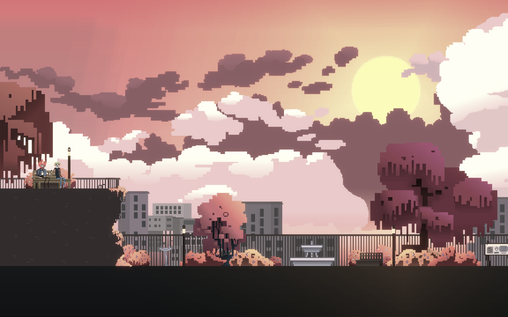

# WashedOut

## About the game

Washed Out is an atmospheric narrative about a day in the life of an introvert. Al is supposed to go out and meet a friend, but is afraid of facing the world outside the house. Help Al discover that there is still beauty to be found, even in a colorless town.

This project was developed by students as part of the project 8-Bit of Bauhaus II at the Bauhaus-University Weimar in the period of 6 months. The idea was to develop a small game in order to study the game development process and develop our skills. 

## Credits

César Daher - Screenwriting and Game Design 

Fabian Krzich - Music and Sound Design

Valerie Lemuth - Programming

Yasemin Yağcı - Artist and Visual Design
